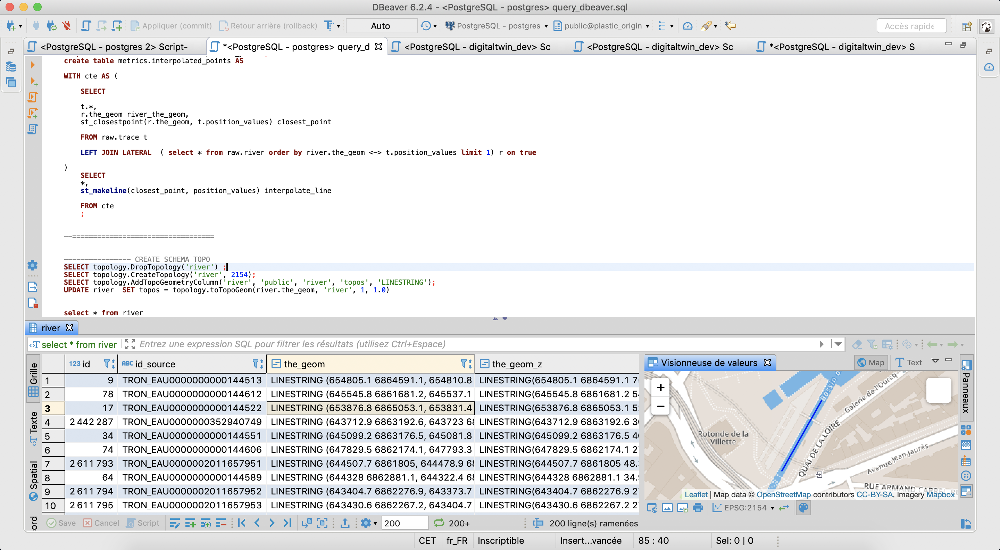
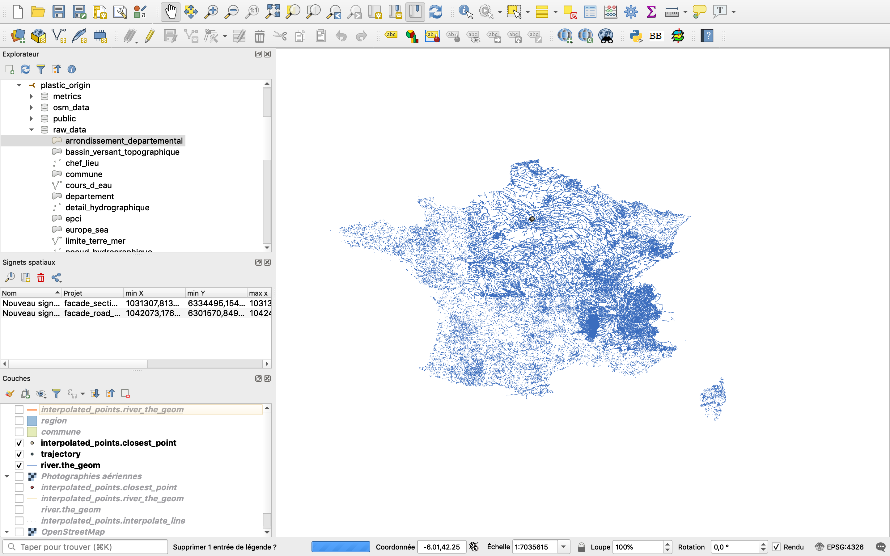

## Deploy plastic origin db in docker:

## Requirements:

* install docker: [link](https://docs.docker.com/docker-for-mac/install/)  

## Install
#### Step 1
Git clone the repo.
```
git clone https://github.com/dataforgoodfr/batch7_surfrider.git
cd batch7_surfrider
```

#### Step 2
* download the latest dump: [here](https://drive.google.com/drive/folders/12FYBDsMXnSHeSQzWh_voHHnvwsfZb44C?usp=sharing) and move it to ``` batch7_surfrider/pg_dump/latest/```

#### Step 3
Run a postgis container
```
docker run --name=podb_postgis -d -e POSTGRES_USER=postgres -e POSTGRES_PASS=postgres -e POSTGRES_DBNAME=plastic_origin_database -e ALLOW_IP_RANGE=0.0.0.0/0 -p 5432:5432 -v "$PWD/volumes/postgres/data":/var/lib/postgresql --restart=always kartoza/postgis:9.6-2.4;
```

Create a temp directory and copy the dump in the container :

```
docker exec -it podb_postgis mkdir /dump;

docker cp "$PWD/pg_dump/latest/dump.sql" podb_postgis:/dump;

```

### Step 4 :

set env variable in podb_postgis and launch the postgresql container

```
docker exec -it  podb_postgis export PGPASSWORD=postgres;

docker exec -it  podb_postgis psql -U postgres -h 0.0.0.0 -d plastic_origin   -f /dump/dump.sql;

```

## Query & visualization :

Database connection:
* host: `0.0.0.0`
* db name: ```plastic_origin```
* username: ```postgres```
* password: ```postgres```

--> query the database with [dbeaver](https://dbeaver.io/)



--> visualize layers with [qgis](https://www.qgis.org/fr/site/)


